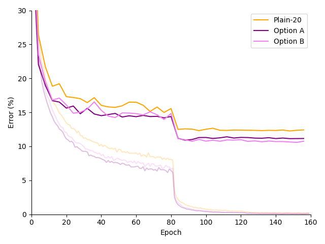

<h1 align="center">Deep Residual Learning for Image Recognition</h1>
PyTorch implementations of the deep residual networks published in "Deep Residual Learning for Image Recognition" by Kaiming He, Xiangyu Zhang, Shaoqing Ren, Jian Sun.

## Methods
The images were preprocessed by subtracting the mean pixel value from each pixel. Additionally,
images are padded by 4 pixels on each side and a random 32x32 crop is used for training.

Stochastic gradient descent (SGD) was used as the optimizer with a weight decay of 0.0001 and
momentum of 0.9. The weights were initialized using the Kaiming normal distribution as described in
[2], and batch normalization following [3] was used after each convolutional layer in DoubleConvBlock.

## Results
#### Plain vs Residual

    

## Notes
#### Anatomy of a Residual Block

            X -----------
            |           |
        weight layer    |
            |           |
        weight layer    |
            |           |
           (+) <---------
            |
           H(X)

This entire block describes the underlying mapping `H(X) = F(X) + X` where `F(X)` is the mapping
described by the two weight layers. Rearranging yields `F(X) = H(X) - X`. This shows that,
instead of directly mapping an input `X` to an output `H(X)`, the weight layers are responsible
for describing what to change, if anything, about the input `X` to reach the desired mapping `H(X)`.

Intuitively, it is easier to modify an existing function than to create a brand new one
from scratch.

#### Option A: Zero-padding

Upon downsampling, the number of feature maps doubles and the side length of each feature map is halved. Pad the original input's channels by 
concatenating extra zero-valued feature maps. Match the new, smaller feature map size by pooling using a 1x1 kernel with stride 2.

[1] argued that Option A performed slightly worse than Option B because "the zero-padded dimensions in A indeed have no residual learning". 

#### Option B: Linear Projections

Use a convolutional layer with 1x1 kernels and stride 2 to linearly project the `N` input channels to 
`2N` output channels. Abstracting each feature map as a single element, the linear projection can be thought
of as a simple 2D operation:

    C_OUT                                                   C_IN
    1       [   W(1,1)      ...         W(1,N)   ]          1       [   X_1   ]
    2       [   W(2,1)      ...         W(2,N)   ]          2       [   X_2   ]
            [                                    ]          .       [    .    ]
    .       [       .                       .    ]          .       [    .    ]
    .       [       .                       .    ]     *    .       [    .    ] 
    .       [       .                       .    ]          N       [   X_N   ]
    .       [       .                       .    ]          
            [                                    ]                  Where each X_i is a feature map
    2N      [   W(2N,1)     ...         W(2N,N)  ]
                        Weight Matrix

The biases have been omitted for simplicity. For an output channel `i`, each of the `j` input channels
is convolved using an independent filter with weights `W(i, j)` and the results are summed together.
This process is repeated for each output channel `i ∈ [1 ... 2N]`.

#### Option C: More Linear Projections
Use the linear projections described in Option B for every shortcut, not just those that down sample.
This introduces more trainable parameters, which [1] argues to be the reason that Option C marginally
outperforms Option B.

## References

[[1](https://arxiv.org/abs/1512.03385)] Kaiming He, Xiangyu Zhang, Shaoqing Ren, Jian Sun. _Deep Residual Learning for Image Recognition_. 
arXiv:1512.03385v1 [cs.CV] 10 Dec 2015.

[[2](https://arxiv.org/abs/1502.01852)] Kaiming He, Xiangyu Zhang, Shaoqing Ren, Jian Sun. _Delving Deep into Rectifiers: Surpassing Human-Level Performance on ImageNet Classification_.
arXiv:1502.01852v1 [cs.CV] 6 Feb 2015.

[[3](https://arxiv.org/abs/1502.03167)] Sergey Ioffe, Christian Szegedy. _Batch Normalization: Accelerating Deep Network Training by Reducing Internal Covariate Shift_.
arXiv:1502.03167v3 [cs.LG] 2 Mar 2015.
