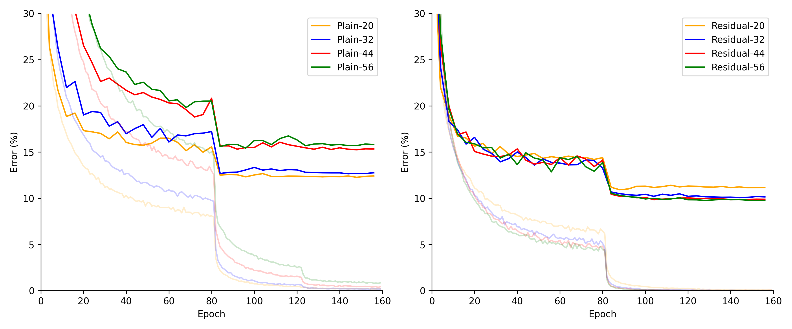

<!--
mlpi
title: Deep Residual Learning for Image Recognition
authors: Kaiming He, Xiangyu Zhang, Shaoqing Ren, Jian Sun
images: results/side_by_side.png, results/plain_vs_residual.png, 
category: Architectures/Residual Neural Networks
--> 

<h1 align="center">Deep Residual Learning for Image Recognition</h1>
PyTorch implementations of the deep residual networks published in "Deep Residual Learning for 
Image Recognition" by Kaiming He, Xiangyu Zhang, Shaoqing Ren, Jian Sun.

## Methods
The images were preprocessed by subtracting the mean pixel value from each pixel. Additionally,
images were padded by 4 pixels on each side and a random 32x32 crop is used for training.

Stochastic gradient descent (SGD) was used as the optimizer with a weight decay of 0.0001, a momentum of 0.9,
and an initial learning rate of 0.1. A MultiStepLR scheduler was used to reduce the learning rate by a factor of 10
at 32k and 48k iterations.
The weights were initialized using the Kaiming normal distribution as described in
[2], and batch normalization following [3] was used after each convolutional layer in DoubleConvBlock.

## Results
Bold lines represent test error while the lighter lines represent training error. 

### Plain vs Residual

    
    

Both residual networks clearly outperform the plain baseline, which confirms the findings in [1]. Option B
outperforms Option A by a small margin, which [1] reasons to be because "the zero-padded dimensions in A indeed 
have no residual learning". 

### Increasing Depth

To show the effects of residual shortcuts on increasingly deeper networks, plain networks are compared to their 
residual counterparts. The residual networks use Option A, which means they have exactly the same number of trainable
parameters as their plain counterparts.

Clearly, the accuracy of the plain networks suffer from increased depth, whereas the residual networks only become more
accurate. 

## Notes
### Anatomy of a Residual Block

            X -----------
            |           |
        weight layer    |
            |           |
        weight layer    |
            |           |
           (+) <---------
            |
           H(X)

This entire block describes the underlying mapping `H(X) = F(X) + X` where `F(X)` is the mapping
described by the two weight layers. Rearranging yields `F(X) = H(X) - X`. This shows that,
instead of directly mapping an input `X` to an output `H(X)`, the weight layers are responsible
for describing what to change, if anything, about the input `X` to reach the desired mapping `H(X)`.

Intuitively, it is easier to modify an existing function than to create a brand new one
from scratch.

### Residual Shortcuts
#### Option A: Zero-padding

Upon downsampling, the number of feature maps doubles and the side length of each feature map is halved. 
Pad the original input's channels by concatenating extra zero-valued feature maps. Match the new, smaller feature map 
size by pooling using a 1x1 kernel with stride 2.

#### Option B: Linear Projections

Use a convolutional layer with 1x1 kernels and stride 2 to linearly project the `N` input channels to 
`2N` output channels. Abstracting each feature map as a single element, the linear projection can be thought
of as a 2D operation:

    C_OUT                                                   C_IN
    1       [   W(1,1)      ...         W(1,N)   ]          1       [   X_1   ]
    2       [   W(2,1)      ...         W(2,N)   ]          2       [   X_2   ]
            [                                    ]          .       [    .    ]
    .       [       .                       .    ]          .       [    .    ]
    .       [       .                       .    ]     *    .       [    .    ] 
    .       [       .                       .    ]          N       [   X_N   ]
    .       [       .                       .    ]          
            [                                    ]               Each X_i is the sum of all 1x1 convolution 
    2N      [   W(2N,1)     ...         W(2N,N)  ]               inputs (stride 2) from the ith feature map
                        Weight Matrix

The biases have been omitted for simplicity. For an output channel `i`, each of the `j` input channels
is convolved using an independent filter with weights `W(i, j)` and the results are summed together.
This process is repeated for each output channel `i ∈ [1 ... 2N]`.

_MODIFICATION_: 

Instead of initializing this convolutional layer's weights using the Kaiming normal distribution,
I instead filled them with <code>1.0 / N</code> where `N` is the number of input channels, and set the biases to `0.0`. 

Let's call this linear projection layer `W`, 
and the input to this DoubleConvBlock `X`. The output of this block is `F(X) = H(X) + W(X)` where `H(X)` is the 
mapping described by this block's inner convolutional layers. To fit the above residual equation, we can see `W(X)` 
should be close to `X` in order to preserve the residual nature of the shortcut. Intuitively, `W`'s weights should not
have a zero mean, as `W(X)` would have a zero response and `F(X) = H(X) + 0`.

To get one output channel, `W` convolves each of the `N` input channels using its own 1x1 kernel and sums together the resulting
feature maps. Thus, for one output channel, 
<code>
    W(X) = w1X1 + ... + wNXN
    = c(X1 + ... + XN)
</code> if all the weights <code>wi</code> are intialized to the same value `c`.
In order to get `W(X)` close to `X`, it makes sense to take the average, or set `c = 1.0 / N`.

#### Option C: More Linear Projections
Use the linear projections described in Option B for every shortcut, not just those that down sample.
This introduces more trainable parameters, which [1] argues to be the reason that Option C marginally
outperforms Option B.

## References

[[1](https://arxiv.org/abs/1512.03385)] Kaiming He, Xiangyu Zhang, Shaoqing Ren, Jian Sun. _Deep Residual Learning for Image Recognition_. 
arXiv:1512.03385v1 [cs.CV] 10 Dec 2015.

[[2](https://arxiv.org/abs/1502.01852)] Kaiming He, Xiangyu Zhang, Shaoqing Ren, Jian Sun. _Delving Deep into Rectifiers: Surpassing Human-Level Performance on ImageNet Classification_.
arXiv:1502.01852v1 [cs.CV] 6 Feb 2015.

[[3](https://arxiv.org/abs/1502.03167)] Sergey Ioffe, Christian Szegedy. _Batch Normalization: Accelerating Deep Network Training by Reducing Internal Covariate Shift_.
arXiv:1502.03167v3 [cs.LG] 2 Mar 2015.
